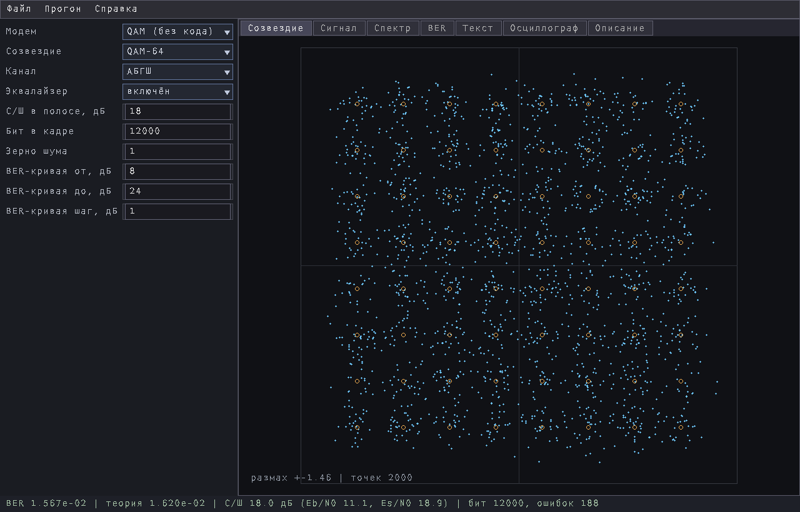
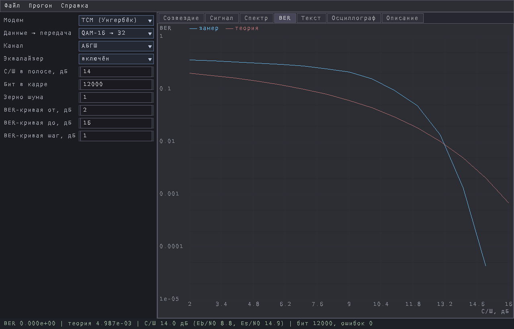
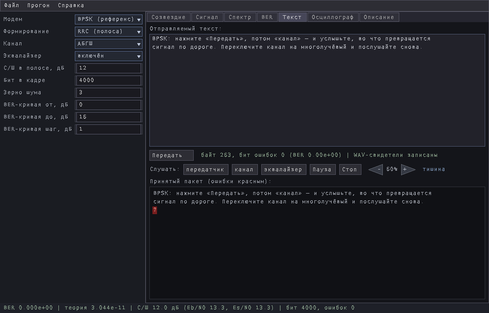

# CommPlayground

**Полигон модемов и каналов.** Соберите тракт — модем, канал, приёмник, —
прогоните через него кадр или целый текст и посмотрите, что получилось:
созвездие, спектр, осциллограмму и замеренную вероятность ошибки **рядом с
теоретической кривой**. Принятый текст показывается с **красными ошибочными
местами**, а сигнал можно **послушать**.



| Модем | |
|---|---|
| **QAM** | 4 … 1024 точки с кодом Грея, без кода |
| **TCM** | решётчатая кодированная модуляция Унгербёка с мягким Витерби |
| **BPSK** | настоящий полосовой тракт: несущая, петля Костаса, захват по преамбуле, формирование RRC |
| **OFDM** | поднесущие, циклический префикс, пилоты |

Каналы: АБГШ, плоские релеевские замирания, многолучёвый — с эквалайзером,
который можно выключить и увидеть, что он делал.

Как всем этим пользоваться — **[Руководство.md](Руководство.md)**.

## Запуск

```sh
./commplayground                 окно
./commplayground проект.cpg      окно с загруженным проектом
./commplayground --selftest      внутренние проверки, без окна
```

Нужен Linux x86-64 и SDL2. Рядом с бинарём должен лежать каталог `assets` —
из него берётся шрифт. Каталог настроек подменяется `COMM_CONFIG_DIR`.

## Ради чего это

|  |  |
|---|---|
|  |  |
| **Выигрыш кодирования, который видно, а не берут на веру.** Синим — замер кодированной модуляции, красным — некодированная QAM той же скорости. Ниже ~13 дБ код ПРОИГРЫВАЕТ: лишние точки созвездия ближе друг к другу. Выше — кривая уходит вниз. | **Свой текст через тракт.** Впишите, нажмите «Передать» — он пойдёт той же дорогой, на которой меряется BER. Ошибки вернутся красными, а сигнал можно послушать: передатчик, канал, выход эквалайзера. |

В `Examples/` лежит 5 проектов — по одному на интересный случай; у каждого в
первых строках сказано, зачем он и на что смотреть. Файл проекта — обычный
текст: модем, настройки и само сообщение.

## Лицензия

MIT — [LICENSE](LICENSE). Канонический текст MIT говорит о «программе **и
сопутствующих файлах документации**», поэтому руководство, снимки экрана и
проекты-примеры — на тех же условиях.

Всего 1,4M. Бинарь обрезан (`strip`), 868K; его собственная приёмка: Приёмка: 239 проверок, отказов 0, пропущено 1 (нужен каталог разработки).

Собрано 07.09.2026.
